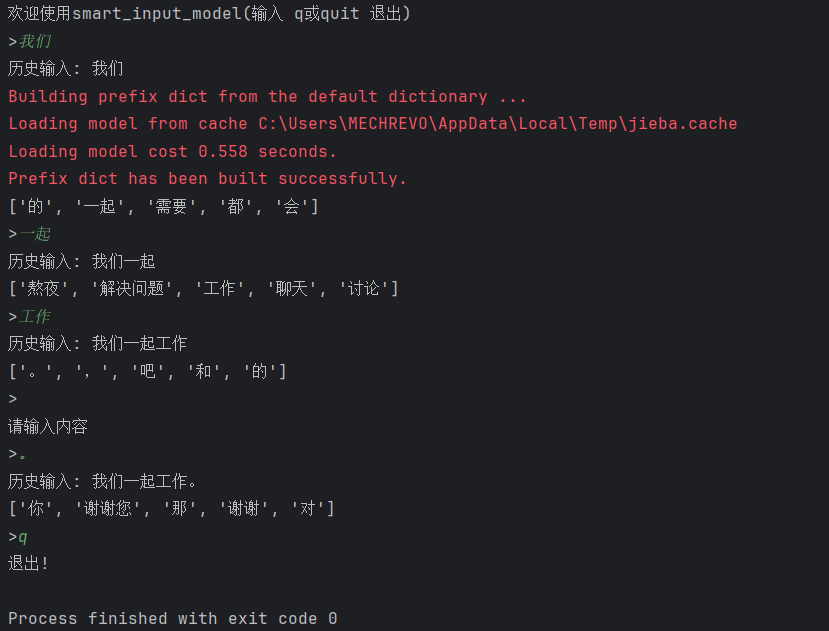

# smart_input_method
智能输入法，通过普通 ```rnn``` 网络做一款输入法。根据输入的历史预测下一个要输入的词
## 效果

```python
"""
欢迎使用smart_input_model(输入 q或quit 退出)
>我们
历史输入: 我们
Building prefix dict from the default dictionary ...
Loading model from cache C:\Users\MECHREVO\AppData\Local\Temp\jieba.cache
Loading model cost 0.558 seconds.
Prefix dict has been built successfully.
['的', '一起', '需要', '都', '会']
>一起
历史输入: 我们一起
['熬夜', '解决问题', '工作', '聊天', '讨论']
>工作
历史输入: 我们一起工作
['。', '，', '吧', '和', '的']
>
请输入内容
>。
历史输入: 我们一起工作。
['你', '谢谢您', '那', '谢谢', '对']
>q
退出!
"""
```
## 整体目录结构
```python
"""
+---data    # 存放数据
|   +---processed   # 经过处理的数据
|   |       test.jsonl
|   |       train.jsonl
|   |
|   \---raw # 原始数据
|           synthesized_.jsonl
|
+---logs    # tensorboard logs
+---models
|       best.pt # 模型
|       vocab.txt   # 词表
|
+---src
|   |   config.py   # 配置文件
|   |   dataset.py  # 创建数据集
|   |   evaluate.py # 评估
|   |   model.py    # 定义模型
|   |   predict.py  # 预测脚本
|   |   process.py  # 数据预处理
|   |   tokenizer.py    # tokenizer
|   |   train.py    # 训练
|
\---test    # 一些测试
    |   test_tensorboard.py
    |
    \---logs
            events.out.tfevents.1774182503.DESKTOP-T0CONCQ.20208.0
"""
```
